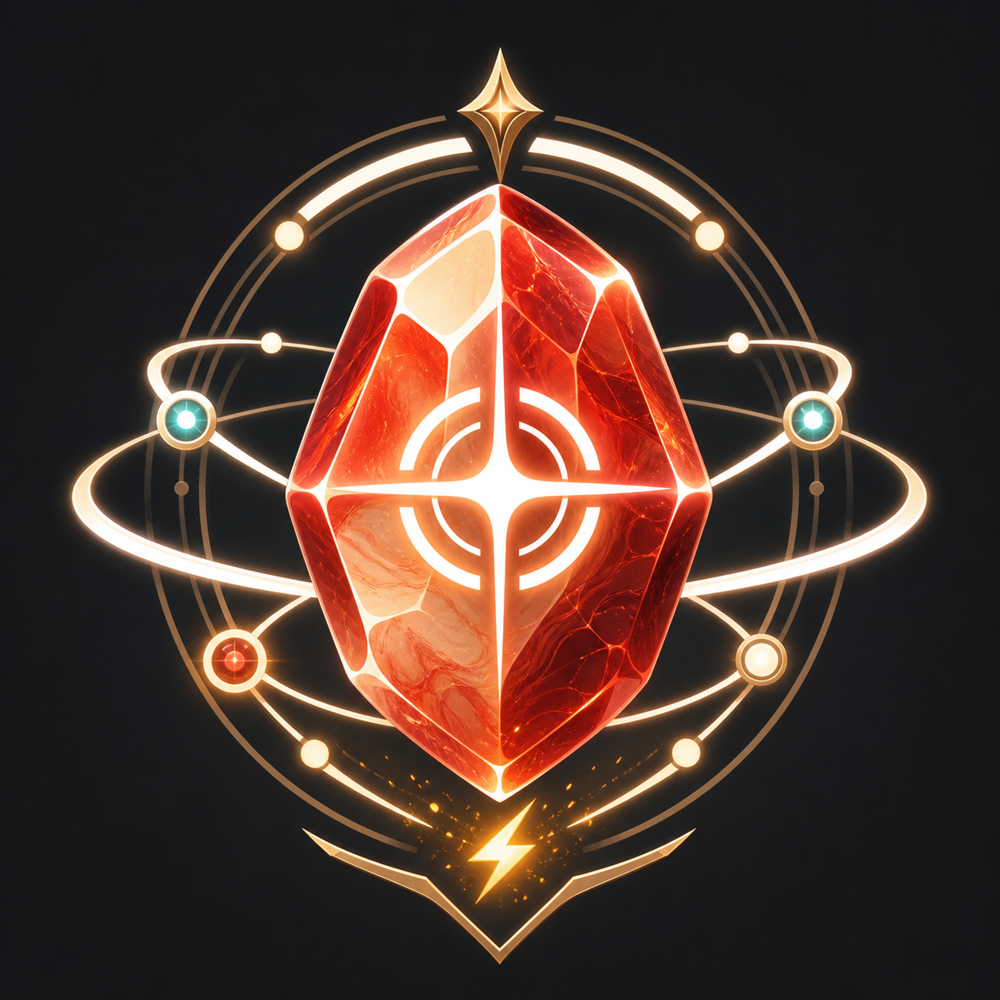

# JasperProfile

  

General-purpose PvE reaction, timeline, and opener profiles for xSalice AIO.

Profiles are being built for synced duty compatibility from early leveling through level 100. The profiles avoid forcing cap-only damage actions in timelines, and low-level safety fallbacks are added where the job kit changes heavily while leveling.

Profile files currently exist for all combat jobs:
- Tanks: Dark Knight, Gunbreaker, Paladin, Warrior
- Healers: Astrologian, Sage, Scholar, White Mage
- Melee DPS: Dragoon, Monk, Ninja, Reaper, Samurai, Viper
- Physical ranged DPS: Bard, Dancer, Machinist
- Magical ranged DPS: Black Mage, Pictomancer, Red Mage, Summoner

This package includes event reactions, timeline shells, and opener files for each supported combat job.

## Current Testing Status

Reference public test profile:
- White Mage

Working beta profiles now exist for every combat job. White Mage remains the reference-tested profile, while the other jobs should be treated as playable beta profiles that still need more duty-by-duty tuning.

The non-WHM profiles focus on safe event automation: mitigation and emergency self-healing are enabled by default where appropriate, cooldown holds and Sprint quality-of-life toggles stay optional, and general timelines remain passive so normal ACR priorities handle damage flow.

Installation instructions are available in [INSTALLATION.md](INSTALLATION.md).

Recent profile updates are tracked in [CHANGELOG.md](CHANGELOG.md).

White Mage is healing-first for general PvE, with DRK invulnerability recovery handling, cleanse support, synced emergency fallbacks, and damage-when-safe behavior. Warrior and the other tank baselines include event-driven dungeon mitigation, emergency invuln support, raidwide and tankbuster mitigation, and optional co-tank support where available. DPS baselines focus on safe event automation such as mitigation, self-healing, reset toggles, optional cooldown holds, and movement quality-of-life.

Timeline profiles cover standard duty content for dungeons, trials, raids, alliance raids, Unreal, Extreme trials, Normal raids, Savage raids, and Chaotic alliance duties where available. General timelines are passive coverage shells and do not force scripted casts; dungeons, roulettes, and normal duties are handled by event reactions plus normal ACR priorities. Fight-specific scripted timelines should be split out separately when they are validated for Savage or similar content. Ultimate, PvP, Deep Dungeons, Treasure Hunt, Variant/Criterion/Another, field content, Gold Saucer, BLU-only Carnivale, and solo quest battles are excluded.

Openers do not use potions. Most starter opener files are intentionally empty until job-specific openers are validated in-game. Timeline profiles do not force potion, weave-toggle, or DPS actions.
